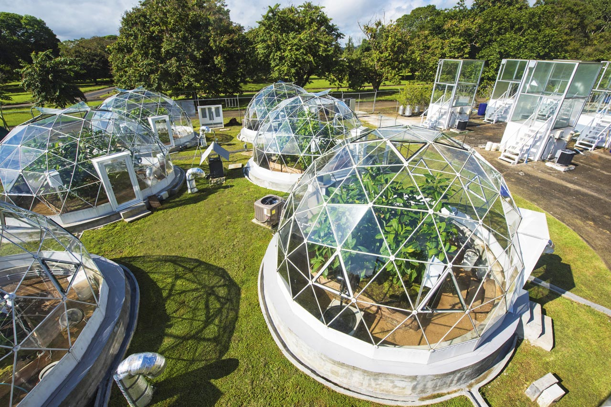

# Code to reproduce analyses and figures from Slot, Rifai and Winter. 2021. *Plant, Cell & Environment*

\
\
Order to reproduce all figures:

(1) R/Plot\_Fig1\_Photo\_ParabolicFit.R\
(2) R/Plot\_Fig3\_Vcmax\_Jmax\_peakedArrhenius\_brms.R\
(3) R/Plot\_Fig2\_Topt\_posteriors.R\
(4) R/Plot\_Fig4\_Ratio\_Jmax\_Vcmax.R\
(5) R/Plot\_Fig5\_gs\_Tleaf\_vpdL.R\
(6) R/Plot\_Fig6\_stomatalLimitation.R\
(7) R/Plot\_Fig7\_Respiration\_R30\_Q10.R\
